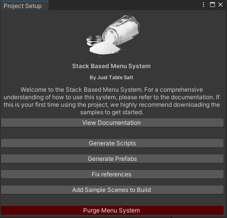

# Unity Stack-Based Menu System Documentation

## 🌟: Overview of the Stack-Based Menu System
This Unity package streamlines UI development by incorporating advanced menu systems and input handling, leveraging Unity's Input System and TextMeshPro for enhanced user interfaces. Designed for ease of integration and flexibility across various game states and scenes.

### How it works

The stack-based menu system in Unity manages menus in a last-in, first-out (LIFO) order, allowing for intuitive navigation and interaction. When a new menu is opened, it is pushed onto the stack, becoming the active menu. Users can easily navigate back or close the menu, where the system pops the top menu off the stack, revealing the previous one. This approach simplifies the management of multiple menus, ensuring a clean and organized UI flow.

Enhancing this system, `BaseMenu.cs` introduces `CloseType` and `MenuType` enums, which allow each menu to exhibit specific behaviors upon closing (`Destroy`, `Hide`, `Disabled`) and to be identified by its function (`Generic`, `Main`, `Options`, etc.). These flags offer the flexibility to configure menus for various scenarios, ensuring they behave appropriately according to their role within the application, from preventing certain menus from closing under specific conditions to maintaining consistent behavior aligned with their designated purpose.


## :gear: Getting Started
**Prerequisites:**
- Unity 2021.3 LTS or later.
- [Text Mesh Pro](https://docs.unity3d.com/Packages/com.unity.textmeshpro@3.2/manual/index.html)
- [New Unity Input System](https://docs.unity3d.com/Packages/com.unity.inputsystem@1.8/manual/Installation.html)

## :wrench: Installation Guide

### Using Unity's Built-in Package Manager
1. **Open Unity's Package Manager**: Navigate to `Window` -> `Package Manager`.
2. **Add Package from Git URL**: Click the `+` icon, select "Add package from git URL," and enter the package's git URL. Click 'Add'.
3. **Install Required Dependencies**: Ensure Text Mesh Pro and the New Unity Input System are installed via the Package Manager.

### Important
Make sure to restart the Unity editor after installation if this is the first time you have installed the new Unity Input System.

## :bookmark_tabs: Quick Start Guide

To ensure the menu system functions correctly within your Unity scene, there are specific components and configurations required. Follow the steps below to set up your scene properly.

### Project Setup Menu

Access the setup menu via `Tools > MenuStackSystem > Setup`.



1. **Generate Scripts**: Click this button to generate necessary scripts.
2. **Generate Prefabs**: Click this button to create prefabs.
3. **Fix References**: Click this **after** you have created a menu via the menu creation window.
4. **Add Sample Scenes to Build**: Click this if you have imported samples to include them in the build settings.
5. **Purge**: Clicking this will delete all files and folders under Prefabs/MenuStackSystem and Scripts/MenuStackSystem

### Menu Creation via GUI

Open the menu creation tool via `Tools > MenuStackSystem > MenuCreation`.


- **Menu Name**: Enter a name here. This name will be used as both the new class name and the GameObject name.
- **Add to Menu Initialiser**: If set to True, this option updates the `MenuInitialiser.cs` script with the newly created menu.
- **Close Type**: Defines how the GameObject will be closed (Options: Destroy, Hide, Disabled).
- **Menu Type**: Sets the type of the menu. Configuring this correctly is crucial for the menu's intended behavior.
- **Add Button Name**: Clicking this button prompts an input field where you can specify a name. A button with this name will be created, including a corresponding function within the menu script. The script will automatically link the button to the function via a listener.
- **Generate Script**: Generates the menu script and saves it to `Assets/Scripts/Menus`.
- **Create and Save Prefab**: Generates a menu prefab, attaches the generated script, and saves it to `Assets/Prefabs/Menus`.

Remember to update your references within the `MenuInitialiser` prefab.

#### Advanced Settings

- **Quick Creation**: Setting this to False disables dialog boxes that normally appear during menu creation.

### Required Components in the Scene

#### MenuManager
The `MenuManager` acts as the central hub for managing all menu interactions. It is crucial for orchestrating the display, hiding, and switching of menus within the game.

- How to Add: Head to `Assets/Prefabs/MenuStackSystem/MenuManager.prefab` and drag the prefab into the scene
- Configuration: Ensure the MenuManager is referencing your `MenuInitialiser.cs`

#### MenuStack_GameManager
The `MenuStack_GameManager` is a template of how to struture your game manager with the menu system. Feel free to expand or replace this as you see fit.

- How to Add: Head to `Assets/Prefabs/MenuStackSystem/MenuStack_GameManager.prefab` and drag the prefab into the scene
- Configuration: Ensure the MenuStack_GameManager is referencing your `MasterInputHandler.cs`

#### EventSystem
The Unity EventSystem is required for handling input events on UI elements. If your scene does not already include an EventSystem, you will need to add one.

- How to Add: Right-click in the Hierarchy pane, navigate to `MenuSystem -> Event System`, and click to add it to your scene.

### Configuring the Initial Menu Display
To have a specific menu appear when the game starts, you must configure the `InitialMenuShow` method within the `MenuInitialiser.cs` script.

- **MenuInitialiser.cs**: The `MenuInitialiser` script is responsible for registering available menus and determining which menu to display first.
- **InitialMenuShow()**: This method defines which menu appears on game start. Modify this method to specify the initial menu.

Example:
```csharp
protected override void InitialMenuShow()
{
    YourStartingMenu.Show();
}
```
Replace `YourStartingMenu` with the class name of the menu you wish to display initially.

## :bookmark_tabs: System Components

### Creating a Menu

This guide walks you through creating a menu in Unity using the StackBasedMenuSystem. We'll create a `MainMenu` class as an example.

#### Step 1: Define Your Menu Class
Start by creating a new C# script named `MainMenu`. This class should inherit from `SimpleMenu<T>`, where `T` is your current menu class.

```csharp
using StackBasedMenuSystem;

public class MainMenu : SimpleMenu<MainMenu>
{
}
```

#### Step 2: Implement Button Actions
Override the BindButtonActions method to bind UI button clicks to your methods. Use FindButtonAndAddListener to link UI buttons to their respective handlers.
```csharp
public override void BindButtonActions()
{
    base.BindButtonActions();

    // Link the Options button to the OnClickOptions method
    FindButtonAndAddListener("OptionsButton", OnClickOptions);
    // Link the Play button to the OnClickPlay method
    FindButtonAndAddListener("PlayButton", OnClickPlay);
}
```

#### Step 3: Define Action Methods
Define what happens when each button is pressed. For instance, opening the options menu or starting the game.
```csharp
public void OnClickOptions()
{
    // Show the options menu
    OptionsMenu.Show();
}

public void OnClickPlay()
{
    // Close the current menu and start the game
    if (Close())
        GameManager.Instance.StartGame();
}
```
This setup allows you to create a menu system where each menu is a class derived from SimpleMenu<T>, providing a structured yet flexible way to handle user input through UI elements.

Make sure to adjust the class and method names according to your project's specific requirements.


### Making an Input Handler
- **Definition**: Input Handlers process user inputs for menus.
- **Implementation**: Guide to creating input handlers using the Unity Input System.
```csharp
using StackBasedMenuSystem;

public class MenuInputHandler : BaseMenuInputHandler
{
    protected override void SubscribeToInputActions()
    {
        inputHandler.PlayerInputActions().UI.Cancel.performed += _ => EscapePressed();
    }

    protected override void UnsubscribeFromInputActions()
    {
        inputHandler.PlayerInputActions().UI.Cancel.performed -= _ => EscapePressed();

    }

    private void EscapePressed()
    {
        //If we are in game we probably wanna pause the game
        if (GameManager.Instance.InGame)
        {
            var menuStack = MenuManager.Instance.GetMenuStack();
            // Toggle pause if no menus are open or the top menu is the pause menu
            if (menuStack.Count == 0 || menuStack.Peek().GetMenuType() == BaseMenu.MenuType.Pause)
            {
                GameManager.Instance.TogglePause();
            }
            //If we get here, it means we are in game and we have a menu open on top of the pause menu, so we close it
            else
            {
                // Close the topmost non-pause menu
                MenuManager.Instance.CloseMenu(menuStack.Peek());
            }
        }
        //If we are in the main menu, just go back on the stack
        else
            MenuManager.Instance.GoBackONMenuStack();
    }
}

```

### Making a Menu Initialiser
- **Purpose**: Initializes menus and input handlers when the game starts or when the scene changes.
- **Configuration**: Configuring initial visible menus and input listeners.

```csharp
using UnityEngine;
using StackBasedMenuSystem;

[RequireComponent(typeof(MenuInputHandler))]
public class MenuInitialiser : BaseMenuInitialiser
{
    //Start Prefab Menus
    [SerializeField] private WelcomeMenu welcomeMenuPrefab;
    [SerializeField] private MainMenu mainMenuPrefab;
    [SerializeField] private OptionsMenu optionsMenuPrefab;
    [SerializeField] private PauseMenu pauseMenuPrefab;
    //End Prefab Menus

    protected override void RegisterMenus()
    {
        //Start Prefab Register
        MenuManager.Instance.RegisterMenuPrefab(welcomeMenuPrefab);
        MenuManager.Instance.RegisterMenuPrefab(mainMenuPrefab);
        MenuManager.Instance.RegisterMenuPrefab(optionsMenuPrefab);
        MenuManager.Instance.RegisterMenuPrefab(pauseMenuPrefab);
        //End Prefab Register
    }
    

    protected override void InitialMenuShow()
    {
        WelcomeMenu.Show();
    }

    protected override void Subscribe()
    {
        GameManager.OnGameStart += HandleGameStart;
        GameManager.OnMenuLoad += HandleMenuLoad;
    }

    protected override void Unsubscribe()
    {
        GameManager.OnGameStart -= HandleGameStart;
        GameManager.OnMenuLoad -= HandleMenuLoad;
    }
}

```


## :memo: API Documentation

This section provides details on the usage of the menu classes within the system, including `SimpleMenu.cs`, `BaseMenu.cs`, and your custom menu classes like `YourCustomMenu.cs`.

### Enums

- **CloseType Enum**: Defines behavior when a menu is closed.
  - `Destroy`: Destroys the GameObject when popped from the stack (e.g., "closed").
  - `Hide`: Simply hides the GameObject, making it invisible but still present in the scene.
  - `Disabled`: Disables the GameObject, making it inactive.

- **MenuType Enum**: Identifies the menu's functional role.
  - 'Generic': A default menu type for general use.
  - 'Main': Represents the main menu. Menus set as Main are persistent and cannot be popped off the stack.

### Methods
- **Show()**: Displays the menu. This is a static method called on the menu class itself.
  Example usage:
  ```csharp
  // Assuming a menu instance's close type can be set directly
  PauseMenu.Show();
  ```
 - **Hide()**: Closes the menu by popping it off the stack. This is a static method called on the menu class itself.
   Example usage:
   ```csharp
   // Assuming a menu instance's close type can be set directly
   PauseMenu.Hide();
   ```
 - **FindButtonAndAddListener(string buttonName, UnityAction action)**: Adds a click event listener to a button within the menu. When the button is clicked, the specified action is triggered.
   Example usage:
   ```csharp
   // Adding a click listener to the "PlayButton"
   FindButtonAndAddListener("PlayButton", OnClickPlayButton);
   
   // Example callback method for when the button is clicked
   void OnClickPlayButton()
   {
       // Actions to perform on button click
   }
   ```
## Acknowledgments

This project has been inspired by and based upon the UnityMenuSystem developed by Yousician and shared under the Apache License. Significant modifications and expansions have been made to adapt to new requirements. We extend our gratitude to the original creators for their foundational work and for sharing their insights through a [tech talk](https://www.youtube.com/watch?v=wbmjturGbAQ) that has been instrumental in the development of this system.

Original Repository: [UnityMenuSystem by YousicianGit](https://github.com/YousicianGit/UnityMenuSystem/tree/master)

## :page_facing_up: License
MIT
