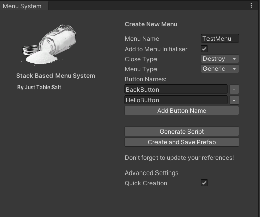

# Unity Stack-Based Menu System Documentation

## 🌟: Overview of the Stack-Based Menu System
This Unity package streamlines UI development by incorporating advanced menu systems and input handling, leveraging Unity's Input System and TextMeshPro for enhanced user interfaces. Designed for ease of integration and flexibility across various game states and scenes.

### How it works

The stack-based menu system in Unity manages menus in a last-in, first-out (LIFO) order, allowing for intuitive navigation and interaction. When a new menu is opened, it is pushed onto the stack, becoming the active menu. Users can easily navigate back or close the menu, where the system pops the top menu off the stack, revealing the previous one. This approach simplifies the management of multiple menus, ensuring a clean and organized UI flow.

Enhancing this system, `BaseMenu.cs` introduces `CloseType` and `MenuType` enums, which allow each menu to exhibit specific behaviors upon closing (`Destroy`, `Hide`, `Disabled`) and to be identified by its function (`Generic`, `Main`, `Options`, etc.). These flags offer the flexibility to configure menus for various scenarios, ensuring they behave appropriately according to their role within the application, from preventing certain menus from closing under specific conditions to maintaining consistent behavior aligned with their designated purpose.


## :gear: Getting Started
**Prerequisites:**
- Unity 2021.3 LTS or later.
- [Text Mesh Pro](https://docs.unity3d.com/Packages/com.unity.textmeshpro@3.2/manual/index.html)
- [New Unity Input System](https://docs.unity3d.com/Packages/com.unity.inputsystem@1.8/manual/Installation.html)

## :wrench: Installation Guide

### Using Unity's Built-in Package Manager
1. **Open Unity's Package Manager**: Navigate to `Window` -> `Package Manager`.
2. **Add Package from Git URL**: Click the `+` icon, select "Add package from git URL," and enter the package's git URL. Click 'Add'.
3. **Install Required Dependencies**: Ensure Text Mesh Pro and the New Unity Input System are installed via the Package Manager.

### Important
Make sure to restart the Unity editor after installation if this is the first time you have installed the new Unity Input System.

## :bookmark_tabs: Quick Start Guide

To ensure the menu system functions correctly within your Unity scene, there are specific components and configurations required. Follow the steps below to set up your scene properly.

### Project Setup Menu

Access the setup menu via `Tools > MenuStackSystem > Setup`.


1. **Generate Scripts**: Click this button to generate necessary scripts. The scripts created will appear under `Scripts/MenuStackSystem`. Take care when using this as it will override any existing prefabs with the same name, this should only be used to setup the project.
2. **Generate Prefabs**: Click this button to create prefabs. The prefabs created will appear under `Prefabs/MenuStackSystem`. Take care when using this as it will override any existing prefabs with the same name, this should only be used to setup the project.
3. **Fix References**: Click this **after** you have created a menu via the menu creation window. It will update `MenuInitialiser.prefab` references with all menus under `Prefabs/MenuStackSystem/Menus`. 
4. **Add Sample Scenes to Build**: Click this if you have imported samples to include them in the build settings.
5. **Purge**: Clicking this will delete all files and folders under Prefabs/MenuStackSystem and Scripts/MenuStackSystem.

### Menu Creation via GUI

Open the menu creation tool via `Tools > MenuStackSystem > MenuCreation`.



- **Menu Name**: Enter a name here. This name will be used as both the new class name and the GameObject name. E.g, Input = PauseMenu, Output = PauseMenu
- **Add to Menu Initialiser**: If set to True, this option updates the `MenuInitialiser.cs` script with the newly created menu.
- **Close Type**: Defines how the GameObject will be closed (Options: Destroy, Hide, Disabled).
- **Menu Type**: Sets the type of the menu. Configuring this correctly is crucial for the menu's intended behavior.
- **Add Button Name**: Clicking this button prompts an input field where you can specify a name. A button with this name will be created, including a corresponding function within the menu script. The script will automatically link the button to the function via a listener. E.g, Input = ExitButton, Output = ExitButton
- **Generate Script**: Generates the menu script and saves it to `Assets/Scripts/Menus`.
- **Create and Save Prefab**: Generates a menu prefab, attaches the generated script, and saves it to `Assets/Prefabs/Menus`.

Remember to update your references within the `MenuInitialiser` prefab.

#### Advanced Settings

- **Quick Creation**: Setting this to False disables dialog boxes that normally appear during menu creation.

### 🔧 Scene Configuration Guide

This guide outlines the essential components required in your Unity scene for an efficient menu management system. Follow these steps to ensure your game's menu system is robust and seamlessly integrated.

#### 1. MenuManager
The `MenuManager` acts as the central hub for managing all menu interactions. It is crucial for orchestrating the display, hiding, and switching of menus within the game.

- How to Add: Head to `Assets/Prefabs/MenuStackSystem/MenuManager.prefab` and drag the prefab into the scene
- Configuration: Ensure the MenuManager is referencing your `MenuInitialiser.cs`

#### 2. MenuStack_GameManager
The `MenuStack_GameManager` is a template of how to struture your game manager with the menu system. Feel free to expand or replace this as you see fit.

- How to Add: Head to `Assets/Prefabs/MenuStackSystem/MenuStack_GameManager.prefab` and drag the prefab into the scene
- Configuration: Ensure the MenuStack_GameManager is referencing your `MasterInputHandler.cs`

#### 3. EventSystem
The Unity EventSystem is required for handling input events on UI elements. If your scene does not already include an EventSystem, you will need to add one.

- How to Add: Right-click in the Hierarchy pane, navigate to `MenuSystem -> Event System`, and click to add it to your scene.

### Configuring the Initial Menu Display
To have a specific menu appear when the game starts, you must configure the `InitialMenuShow` method within the `MenuInitialiser.cs` script.

- **MenuInitialiser.cs**: The `MenuInitialiser` script is responsible for registering available menus and determining which menu to display first.
- **InitialMenuShow()**: This method defines which menu appears on game start. Modify this method to specify the initial menu.

Example:
```csharp
protected override void InitialMenuShow()
{
    YourStartingMenu.Show();
}
```
Replace `YourStartingMenu` with the class name of the menu you wish to display initially.

### Best Practices

- **Do**:
  - Use the Menu Creation GUI for creating menus, ensuring to select Add to `Menu Initialiser for integration`. This will ensure that you have added the newly created menu to the `MenuInitaliser.cs` class.
  - Click Fix References after creating menus for `consistent references`. This will iterate through all menus under `Assets/Scripts/MenuStackSystem/Menus` and link them to the references within `MenuInitaliser.prefab`.
- **Do Not**:
  - Create menus manually or through the Menu Creation window without using `Generate Scripts` and `Generate Prefabs` in the Setup Window beforehand. 
- **Troubleshooting**:
  - If encountering errors, attempt to regenerate scripts and prefabs through the Setup Window.
  - If the csproj files are not generating you will need to go to `Preferences -> External Tools` tick `Git Packages`, and then regenerate the project files.
  - Avoid creating menus manually without using `Generate Scripts` and `Generate Prefabs` in the Setup Window beforehand. 
    
## :bookmark_tabs: System Components

### **Creating a Menu**

This guide walks you through creating a menu in Unity using the StackBasedMenuSystem. We'll create a `MainMenu` class as an example.

#### Step 1: Define Your Menu Class
Start by creating a new C# script named `MainMenu`. This class should inherit from `SimpleMenu<T>`, where `T` is your current menu class.

```csharp
using StackBasedMenuSystem;

public class MainMenu : SimpleMenu<MainMenu>
{
}
```

#### Step 2: Implement Button Actions
Override the BindButtonActions method to bind UI button clicks to your methods. Use FindButtonAndAddListener to link UI buttons to their respective handlers.
```csharp
public override void BindButtonActions()
{
    base.BindButtonActions();

    // Link the Options button to the OnClickOptions method
    FindButtonAndAddListener("OptionsButton", OnClickOptions);
    // Link the Play button to the OnClickPlay method
    FindButtonAndAddListener("PlayButton", OnClickPlay);
}
```

#### Step 3: Define Action Methods
Define what happens when each button is pressed. For instance, opening the options menu or starting the game.
```csharp
public void OnClickOptions()
{
    // Show the options menu
    OptionsMenu.Show();
}

public void OnClickPlay()
{
    // Close the current menu and start the game
    if (Close())
        GameManager.Instance.StartGame();
}
```
This setup allows you to create a menu system where each menu is a class derived from SimpleMenu<T>, providing a structured yet flexible way to handle user input through UI elements.

Make sure to adjust the class and method names according to your project's specific requirements.


### **Creating an Input Handler**

Input Handlers are crucial for processing user inputs within menus, especially when integrating with the Unity Input System. This guide provides a structured approach to creating an input handler that responds to user actions, such as pressing a back button or handling pause functionality.

#### **Overview**

- **Definition**: Input Handlers manage the input events for menu navigation and interaction.
- **Implementation**: This section outlines how to implement an input handler using the Unity Input System, focusing on handling escape or back actions.

#### **Step-by-Step Implementation**

1. **Create the Input Handler Class**: Start by creating a new C# script named `MenuInputHandler`. This class should inherit from `BaseMenuInputHandler` to leverage base functionalities.

    ```csharp
    using StackBasedMenuSystem;

    public class MenuInputHandler : BaseMenuInputHandler
    {
    }
    ```

2. **Subscribe to Input Actions**: Override the `SubscribeToInputActions` method to listen for specific input actions, such as pressing the escape key or back button on a controller.

    ```csharp
    protected override void SubscribeToInputActions()
    {
        inputHandler.PlayerInputActions().UI.Cancel.performed += _ => EscapePressed();
    }
    ```

3. **Unsubscribe from Input Actions**: Ensure you properly unsubscribe from the input actions in the `UnsubscribeFromInputActions` method to prevent memory leaks or unintended behavior.

    ```csharp
    protected override void UnsubscribeFromInputActions()
    {
        inputHandler.PlayerInputActions().UI.Cancel.performed -= _ => EscapePressed();
    }
    ```

4. **Implement the Escape Action**: Define what happens when the escape action is triggered. This could involve pausing the game, closing the current menu, or navigating back in the menu stack.

    ```csharp
    private void EscapePressed()
    {
        if (GameManager.Instance.InGame)
        {
            var menuStack = MenuManager.Instance.GetMenuStack();
            if (menuStack.Count == 0 || menuStack.Peek().GetMenuType() == BaseMenu.MenuType.Pause)
            {
                GameManager.Instance.TogglePause();
            }
            else
            {
                MenuManager.Instance.CloseMenu(menuStack.Peek());
            }
        }
        else
        {
            MenuManager.Instance.GoBackOnMenuStack();
        }
    }
    ```

#### **Key Considerations**

- **Handling Game States**: The input handler should consider different game states (e.g., in-game vs. main menu) to determine the appropriate response to input actions.
- **Menu Stack Management**: Utilize the menu stack to manage menu visibility and navigation logically, ensuring a smooth user experience.
- **Flexibility and Reusability**: Design your input handler to be flexible and reusable across different menus and game scenes.

By following these steps, you can effectively implement a responsive and intuitive input handling system for your game's menus, enhancing player interaction and navigation.


### **Menu Initialiser**

The `MenuInitialiser` class plays a pivotal role in setting up your game's menu system at the start or upon scene changes. It ensures that your menus and input handlers are ready to go, right from the get-go.

#### **Purpose**

- Initializes menus and input handlers as the game starts or during scene transitions.
- Configures the initial visibility of menus and sets up input listeners for user interactions.

#### **Configuration Steps**

1. **Attach Required Component**: Ensure that `MenuInputHandler` is attached to the same GameObject as `MenuInitialiser` to handle input efficiently.

    ```csharp
    [RequireComponent(typeof(MenuInputHandler))]
    ```

2. **Define Menu Prefabs**: Specify which menu prefabs to include in your game. You can add these directly through the Unity Editor by marking the prefabs as `SerializeField`.

    ```csharp
    [SerializeField] private WelcomeMenu welcomeMenuPrefab;
    [SerializeField] private MainMenu mainMenuPrefab;
    [SerializeField] private OptionsMenu optionsMenuPrefab;
    [SerializeField] private PauseMenu pauseMenuPrefab;
    ```

3. **Register Menus**: In the `RegisterMenus` method, register each menu prefab with the `MenuManager` to make them available for use. This step can be automated through the menu creation window by selecting "Add to Menu Initialiser".

    ```csharp
    protected override void RegisterMenus()
    {
        MenuManager.Instance.RegisterMenuPrefab(welcomeMenuPrefab);
        MenuManager.Instance.RegisterMenuPrefab(mainMenuPrefab);
        MenuManager.Instance.RegisterMenuPrefab(optionsMenuPrefab);
        MenuManager.Instance.RegisterMenuPrefab(pauseMenuPrefab);
    }
    ```

4. **Initial Menu Display**: The `InitialMenuShow` method specifies which menu to display first when the scene loads. Customize this to set your starting menu.

    ```csharp
    protected override void InitialMenuShow()
    {
        WelcomeMenu.Show(); // Replace WelcomeMenu with your starting menu class
    }
    ```

5. **Event Subscription**: Implement the `Subscribe` and `Unsubscribe` methods to manage event listeners for game start and menu load events. This ensures your menu system responds to game states appropriately.

    ```csharp
    protected override void Subscribe()
    {
        GameManager.OnGameStart += HandleGameStart;
        GameManager.OnMenuLoad += HandleMenuLoad;
    }

    protected override void Unsubscribe()
    {
        GameManager.OnGameStart -= HandleGameStart;
        GameManager.OnMenuLoad -= HandleMenuLoad;
    }
    ```

#### **Tips for Success**

- **Automate Menu Registration**: Leverage the menu creation window's "Add to Menu Initialiser" feature to simplify the process of adding new menus.
- **Dynamic First Menu**: Consider game state or player preferences when determining the initial menu, making your game more responsive to user needs.
- **Stay Subscribed**: Ensure your `MenuInitialiser` is always subscribed to relevant game events to maintain a responsive and dynamic menu system.

By following these steps and tips, you'll set up a robust and responsive menu system, enhancing the user experience from the moment your game starts.


## :memo: API Documentation

This section provides details on the usage of the menu classes within the system, including `SimpleMenu.cs`, `BaseMenu.cs`, and your custom menu classes like `YourCustomMenu.cs`.

### Enums

- **CloseType Enum**: Defines behavior when a menu is closed.
  - `Destroy`: Destroys the GameObject when popped from the stack (e.g., "closed").
  - `Hide`: Simply hides the GameObject, making it invisible but still present in the scene.
  - `Disabled`: Disables the GameObject, making it inactive.

- **MenuType Enum**: Identifies the menu's functional role.
  - 'Generic': A default menu type for general use.
  - 'Main': Represents the main menu. Menus set as Main are persistent and cannot be popped off the stack.

### Methods
- **Show()**: Displays the menu. This is a static method called on the menu class itself.
  Example usage:
  ```csharp
  // Assuming a menu instance's close type can be set directly
  PauseMenu.Show();
  ```
 - **Hide()**: Closes the menu by popping it off the stack. This is a static method called on the menu class itself.
   Example usage:
   ```csharp
   // Assuming a menu instance's close type can be set directly
   PauseMenu.Hide();
   ```
 - **FindButtonAndAddListener(string buttonName, UnityAction action)**: Adds a click event listener to a button within the menu. When the button is clicked, the specified action is triggered.
   Example usage:
   ```csharp
   // Adding a click listener to the "PlayButton"
   FindButtonAndAddListener("PlayButton", OnClickPlayButton);
   
   // Example callback method for when the button is clicked
   void OnClickPlayButton()
   {
       // Actions to perform on button click
   }
   ```
## Acknowledgments

This project has been inspired by and based upon the UnityMenuSystem developed by Yousician and shared under the Apache License. Significant modifications and expansions have been made to adapt to new requirements. We extend our gratitude to the original creators for their foundational work and for sharing their insights through a [tech talk](https://www.youtube.com/watch?v=wbmjturGbAQ) that has been instrumental in the development of this system.

Original Repository: [UnityMenuSystem by YousicianGit](https://github.com/YousicianGit/UnityMenuSystem/tree/master)

## :page_facing_up: License
MIT
